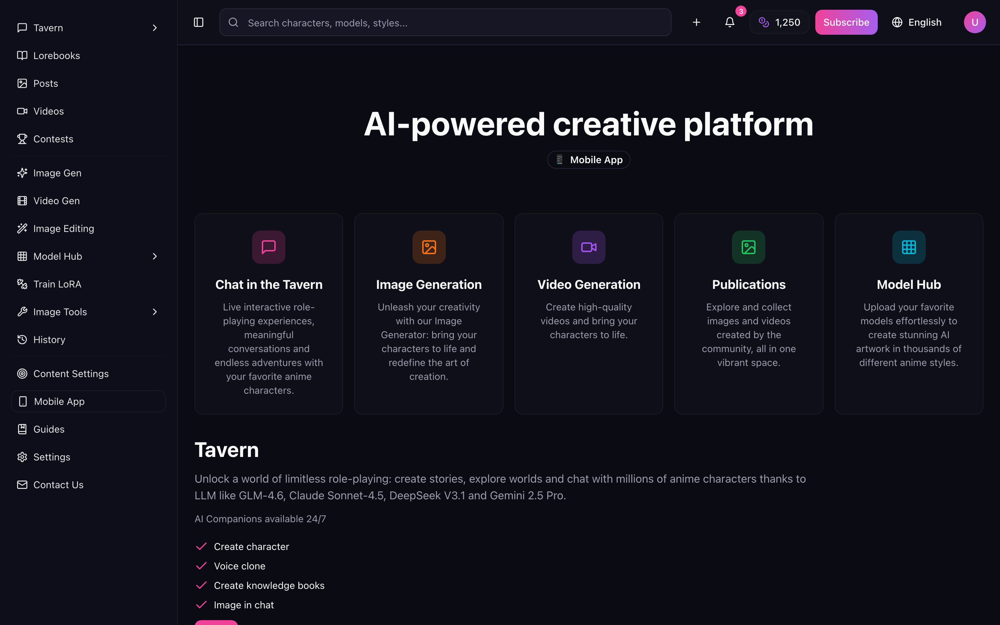
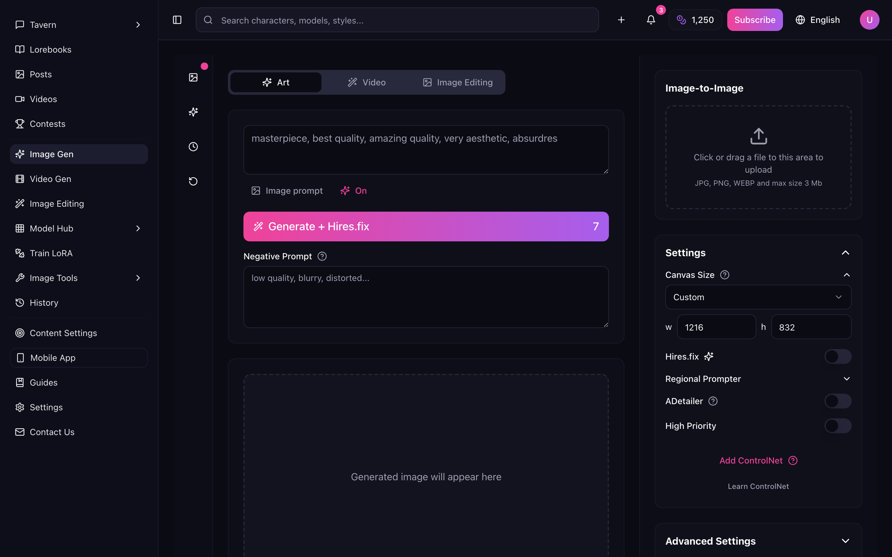
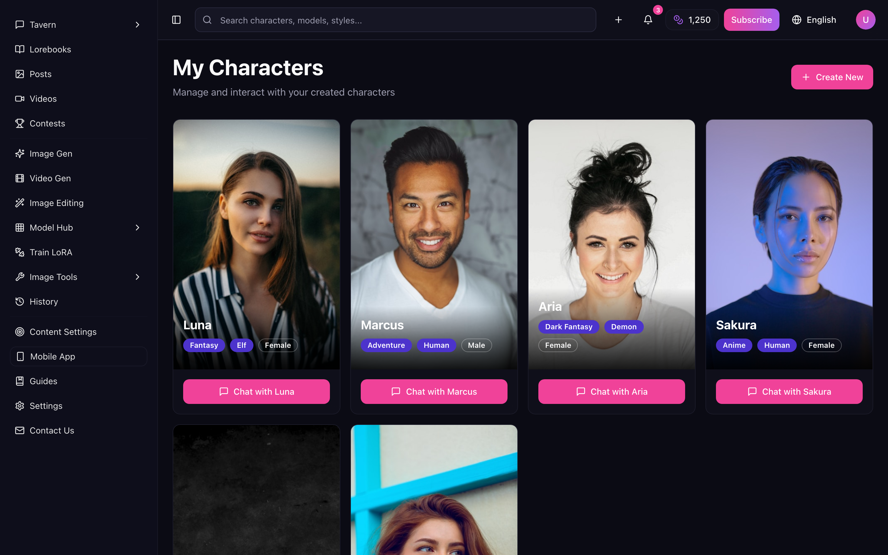
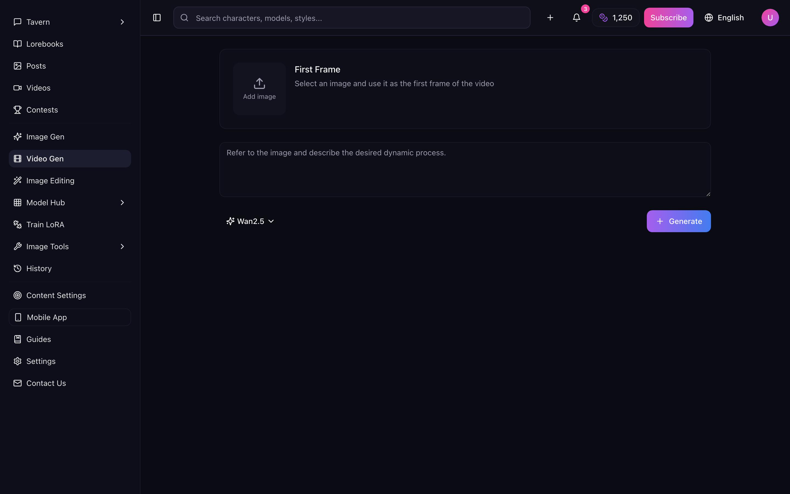
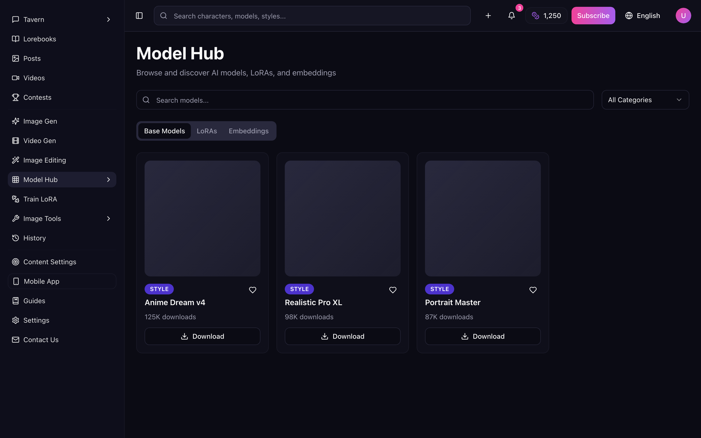
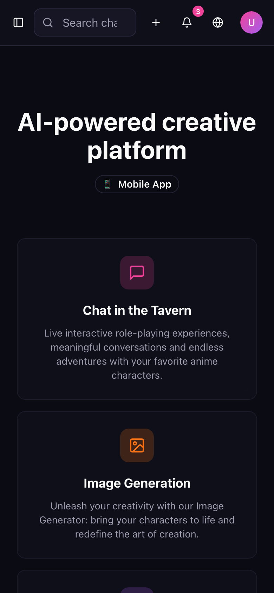

# Aoi Studio 🎨✨

> A neon-drenched, anime-flavored **AI creative studio** — generate images and video, chat with
> characters, browse the model hub, and build your own worlds. All in one bilingual (English /
> Español) single-page app.

Aoi (**葵 / 青**, "blue") is the calm-blue-hour color of a screen glowing at 2 a.m. while you make
something. This is the front-end for exactly that vibe: a fast, polished, dark-mode studio UI for
anime AI creation. Think of it as the cockpit — every dial, tab, and toggle a real creative tool
would need, wired into a clean React app you can run in one command.



---

## ✨ Why it's cool

- **A whole studio, not a single screen.** Home, Image Generator, Video Generator, Characters,
  Chat, Model Hub, Tools, History, Account and Settings — a real multi-page product surface.
- **Bilingual from the first click.** A friendly language gate (🇪🇸 / 🇺🇸) that **remembers your
  choice** across reloads and keeps `<html lang>` in sync for screen readers and search engines.
- **Neon design system.** HSL-token theming, glow hovers, glassy blur cards, custom scrollbars —
  all defined in one tidy `index.css` so re-skinning is a colour swap away.
- **Genuinely responsive.** From a 390 px phone to an ultrawide monitor, nothing spills off-screen.
- **Fast + type-safe.** Vite + React 18 + TypeScript + Tailwind + shadcn/ui. `tsc` clean,
  `vite build` clean.

| Image Generator | Characters |
| --- | --- |
|  |  |

| Video Generator | Model Hub |
| --- | --- |
|  |  |

<p align="center">
  
  <br />
  <em>Looks just as sharp with a phone in your hand.</em>
</p>

---

## 🚀 Quick start (zero to running in ~2 minutes)

You'll need **Node.js 18+** and **npm**. Not sure if you have them? Run `node -v` — if it prints a
version number, you're golden. If not, grab it from [nodejs.org](https://nodejs.org/) (or with
[nvm](https://github.com/nvm-sh/nvm#installing-and-updating), which is the tidy way).

```bash
# 1. Clone the repo
git clone https://github.com/waleedsworld/aoi-ke-haroon-58.git
cd aoi-ke-haroon-58

# 2. Install the dependencies
npm install

# 3. Fire up the dev server (hot-reloads as you edit)
npm run dev
```

Now open the URL it prints (usually **http://localhost:8080**) and you're in. Pick a language and
start clicking around. 🎉

### Building for production

```bash
npm run build      # bundles into dist/
npm run preview    # serves the built dist/ locally to sanity-check it
```

That `dist/` folder is a plain static bundle — drop it on any static host (Cloudflare Pages, Netlify,
GitHub Pages, an S3 bucket, your fridge if it serves HTML).

---

## 🧭 The map (project structure)

```
src/
├── pages/            # one file per route (Home, ImageGenerator, VideoGenerator, Chat, …)
├── components/
│   ├── AppSidebar    # the collapsible left navigation
│   ├── TopBar        # search, create menu, coins, language, account
│   └── ui/           # shadcn/ui primitives (buttons, cards, dialogs, …)
├── contexts/
│   └── LanguageContext  # the ES/EN switch + persistence + translations
├── layouts/
│   └── MainLayout    # sidebar + topbar shell wrapped around every page
├── index.css         # the neon design system (all colours as HSL tokens)
└── App.tsx           # routes
```

Routing is handled by **react-router-dom**. The language layer is a tiny context with a `t("key")`
helper and an inline translation dictionary — no i18n framework to wrestle, easy to extend: add a
key to `translations`, use `t("your.key")`, done.

---

## 🛠️ Tech stack

- **Vite 5** — instant dev server + lean production builds
- **React 18 + TypeScript** — type-safe components
- **Tailwind CSS 3** + **shadcn/ui** + **Radix UI** — the design system + accessible primitives
- **react-router-dom** — client-side routing
- **lucide-react** — crisp icon set
- **TanStack Query** — data-fetching plumbing, ready for when a backend arrives

---

## 🗺️ Roadmap-ish

This is a **front-end / UI build** — the generation panels are wired up and interactive, ready to be
connected to real image/video model endpoints. Natural next steps:

- Hook the Image & Video generators up to a real inference API.
- Persist History and Account to a backend (the UI is already there).
- More languages (the `LanguageContext` is built to grow).

## 🌐 Live demo

Deploying soon — a hosted version is on the way. Until then, `npm run dev` gives you the full
experience in under two minutes.

## 📄 License

Released under the MIT License — build on it, remix it, make something lovely.
