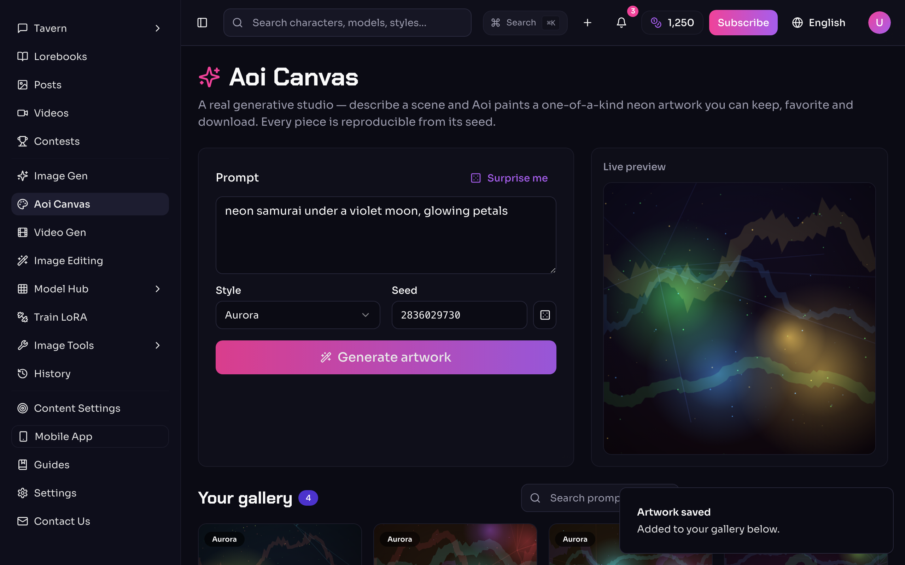
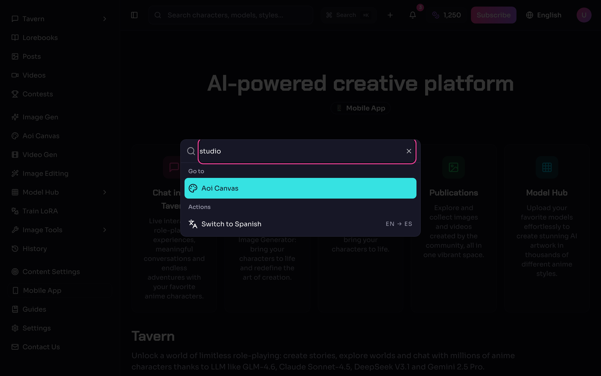
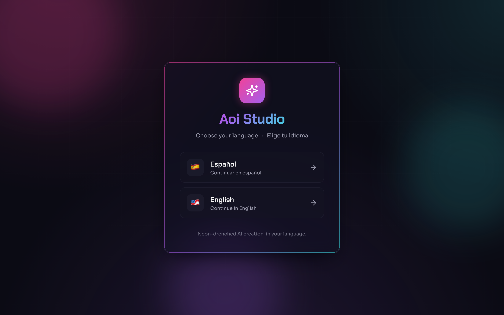
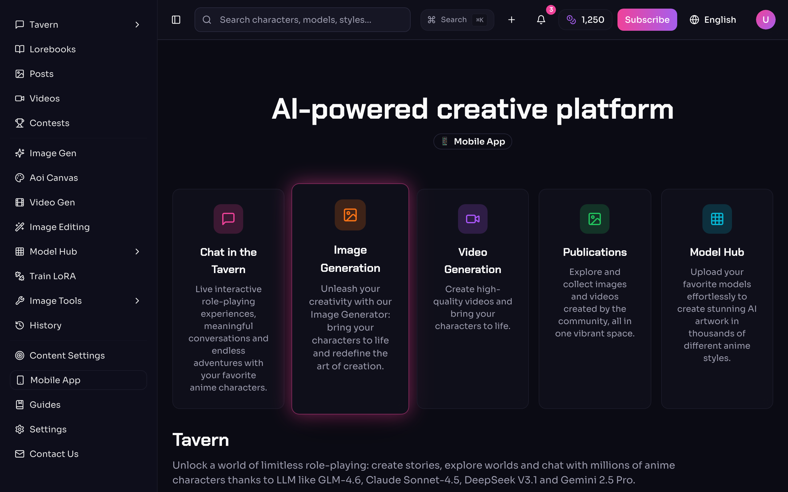
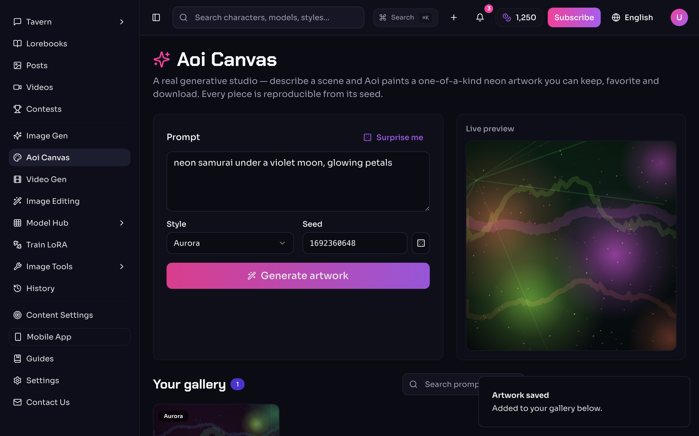
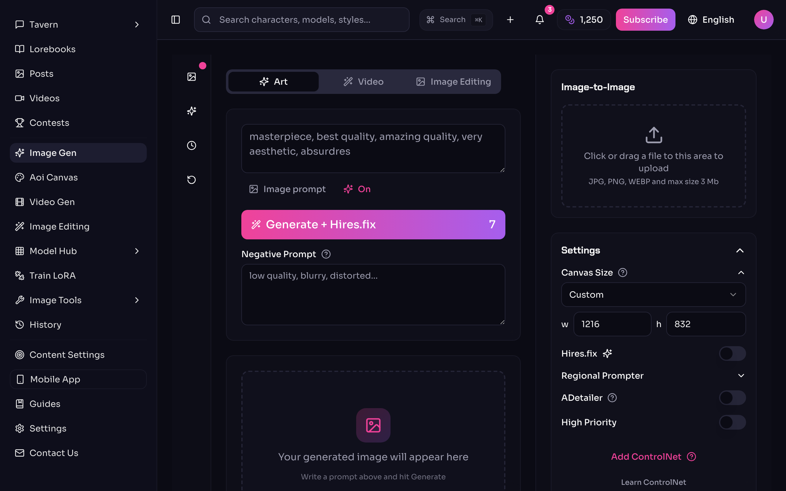
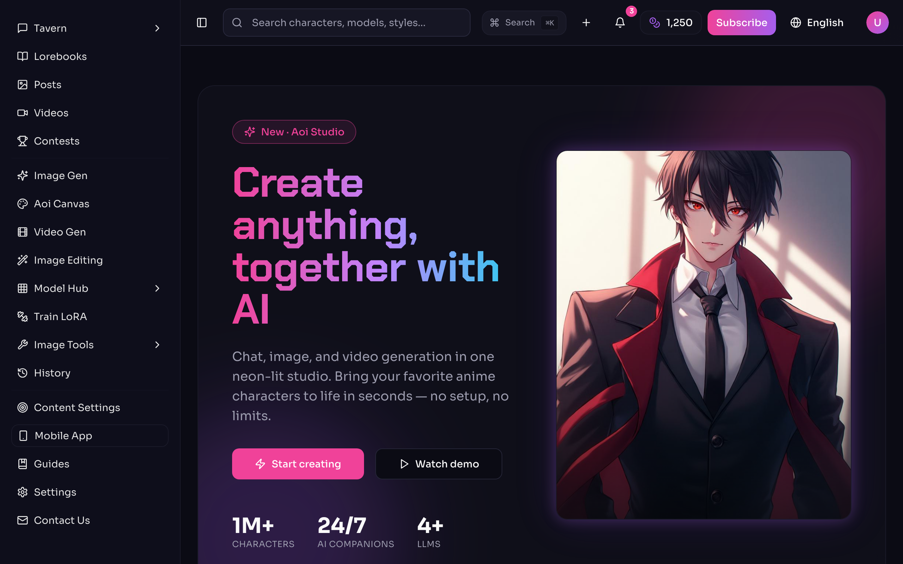
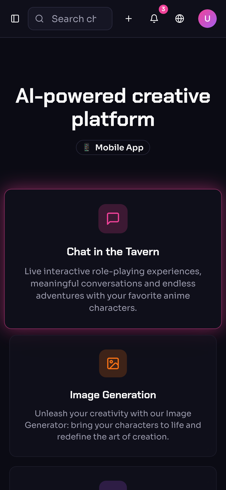

# Aoi Studio 🎨✨

<p align="center">
  
  
  
  
  
  
  
  
</p>

> A neon-drenched, anime-flavored **AI creative studio** — paint one-of-a-kind generative art,
> generate images and video, chat with characters, browse the model hub, and build your own worlds.
> All in one bilingual (English / Español) single-page app.

Aoi (**葵 / 青**, "blue") is the calm-blue-hour color of a screen glowing at 2 a.m. while you make
something. This is the front-end for exactly that vibe: a fast, polished, dark-mode studio for anime
AI creation. Think of it as the cockpit — every dial, tab, and toggle a real creative tool would
need — except now one of those dials is a **real, working generative art engine**.

<p align="center">
  
  <br />
  <em>Pick a language → hop around with ⌘K → paint neon art on the Aoi Canvas → keep it in your gallery.</em>
</p>

---

## ✨ What's new in this release

This cycle turned Aoi Studio from a beautiful shell into a beautiful shell **with a beating heart**.

### 🖌️ Aoi Canvas — a real generative art studio
Not a placeholder. Describe a scene, pick a style (Aurora, Nebula, Bloom, Circuit…), and a
deterministic procedural engine **paints a genuine, one-of-a-kind neon artwork onto a `<canvas>`**.
Every piece is:

- **Reproducible from its seed** — same seed + prompt + style ⇒ same art, every time. Re-roll for a
  fresh universe.
- **Yours to keep** — save to a **persistent gallery** (localStorage), favorite it, search it,
  download the PNG. Close the tab and it's still there when you come back.
- **Live-previewed** as you tweak, so you sculpt before you commit.

<p align="center">
  
</p>

### ⌘K Command palette
Press **⌘K / Ctrl-K anywhere** to fly across the whole app — fuzzy-search every route (Aoi Canvas
included) and flip the language without lifting your hands off the keyboard.

<p align="center">
  
</p>

### The rest of the glow-up
- **♿ Accessibility + performance.** Route-level code-splitting (the initial bundle now ships just
  the language gate, then lazy-loads each page), a keyboard **skip link**, proper landmarks &
  focus-visible rings, and full **`prefers-reduced-motion`** support.
- **🎨 A sharper design system.** A distinctive display typeface, an ambient animated neon canvas
  behind the UI, a premium glass language gate, and richer loading/empty states.
- **📱 Rock-solid responsiveness.** Overflow gremlins on phones & tablets squashed — nothing spills
  off-screen from 390 px to ultrawide.
- **🧪 A real test suite.** **23 unit tests** (Vitest + Testing Library) and **5 Playwright e2e**
  smoke flows, wired into **GitHub Actions CI**.
- **🔎 Discoverable by default.** JSON-LD structured data, canonical URL, `sitemap.xml`, a PWA
  `site.webmanifest` with a full icon set — installable and search-friendly.
- **🧪 A/B hero experiment.** A second landing hero lives behind `?variant=b` for painless
  copy/layout testing (see [`docs/LANDING_VARIANTS.md`](docs/LANDING_VARIANTS.md)).

---

## 🖼️ A look around

| Language gate | Home dashboard |
| --- | --- |
|  |  |

| Aoi Canvas (generating) | Image Generator |
| --- | --- |
|  |  |

**A/B landing** — the same page, two heroes. Append `?variant=b` to compare:

| Variant A (default) | Variant B (`?variant=b`) |
| --- | --- |
|  |  |

**Light mode & mobile** — theme-aware and sharp with a phone in your hand:

<p align="center">
  
  &nbsp;
  
</p>

---

## 🚀 Quick start (zero to running in ~2 minutes)

You'll need **Node.js 18+** and **npm**. Not sure if you have them? Run `node -v` — if it prints a
version number, you're golden. If not, grab it from [nodejs.org](https://nodejs.org/) (or with
[nvm](https://github.com/nvm-sh/nvm#installing-and-updating), which is the tidy way).

```bash
# 1. Clone the repo
git clone https://github.com/waleedsworld/aoi-ke-haroon-58.git
cd aoi-ke-haroon-58

# 2. Install the dependencies
npm install

# 3. Fire up the dev server (hot-reloads as you edit)
npm run dev
```

Now open the URL it prints (usually **http://localhost:8080**), **pick a language to pass through the
gate**, and you're in. Head to **Aoi Canvas** and paint something. 🎉

### Test it & build it

```bash
npm test           # 23 unit tests (Vitest)
npm run test:e2e   # 5 Playwright smoke flows
npm run build      # bundles into dist/ (code-split, one chunk per route)
npm run preview    # serves the built dist/ locally to sanity-check it
```

That `dist/` folder is a plain static bundle — drop it on any static host (Cloudflare Pages, Netlify,
GitHub Pages, an S3 bucket, your fridge if it serves HTML).

---

## 🧭 The map (project structure)

```
src/
├── pages/
│   ├── Studio.tsx        # ⭐ Aoi Canvas — the generative art studio
│   ├── Home, ImageGenerator, VideoGenerator, Chat, Characters, …
│   └── (each route lazy-loaded via React.lazy)
├── lib/
│   ├── procedural-art.ts # ⭐ the seeded neon painting engine
│   └── creations-store.ts# ⭐ persistent gallery (localStorage)
├── components/
│   ├── CommandPalette     # ⌘K global navigation
│   ├── SkipLink           # keyboard "skip to content"
│   ├── AppSidebar / TopBar
│   └── ui/                # shadcn/ui primitives
├── contexts/
│   └── LanguageContext    # ES/EN switch + persistence + translations
├── layouts/MainLayout     # sidebar + topbar shell with a11y landmarks
└── index.css              # the neon design system (all colours as HSL tokens)
```

Routing is **react-router-dom**; the language layer is a tiny context with a `t("key")` helper and an
inline dictionary — no i18n framework to wrestle. Add a key to `translations`, use `t("your.key")`,
done.

---

## 🛠️ Tech stack

- **Vite 5** — instant dev server + lean, code-split production builds
- **React 18 + TypeScript** — type-safe components, `React.lazy` route splitting
- **Tailwind CSS 3** + **shadcn/ui** + **Radix UI** — design system + accessible primitives
- **react-router-dom** — client-side routing
- **Vitest + Testing Library + Playwright** — unit + e2e, green in CI
- **lucide-react** — crisp icon set
- **TanStack Query** — data-fetching plumbing, ready for when a backend arrives

---

## 🗺️ Roadmap-ish

The generation panels are wired up and interactive, and **Aoi Canvas already renders real art**.
Natural next steps:

- Hook the Image & Video generators up to real inference endpoints (Canvas shows the pattern).
- Persist History and Account to a backend (the UI is already there).
- More languages — the `LanguageContext` is built to grow.

## 🌐 Live demo

**Deploying soon** — a hosted version is on the way. Until then, `npm run dev` gives you the full
experience in under two minutes.

## 📄 License

Released under the MIT License — build on it, remix it, make something lovely.
